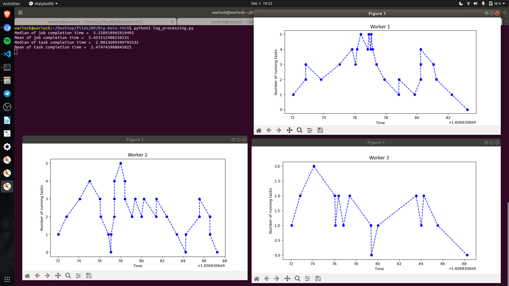
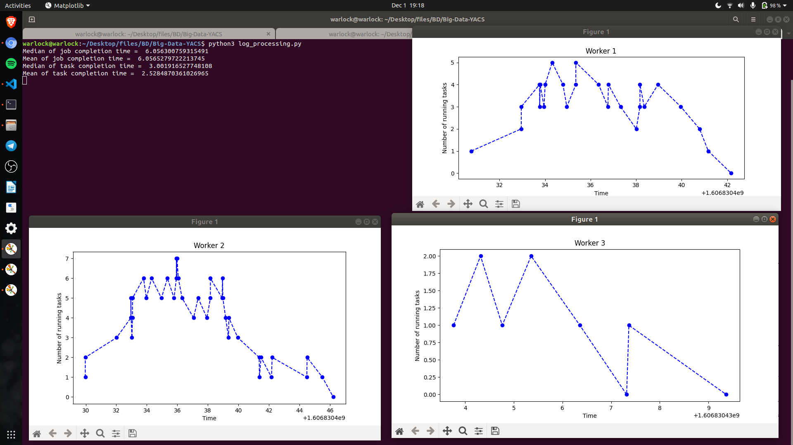
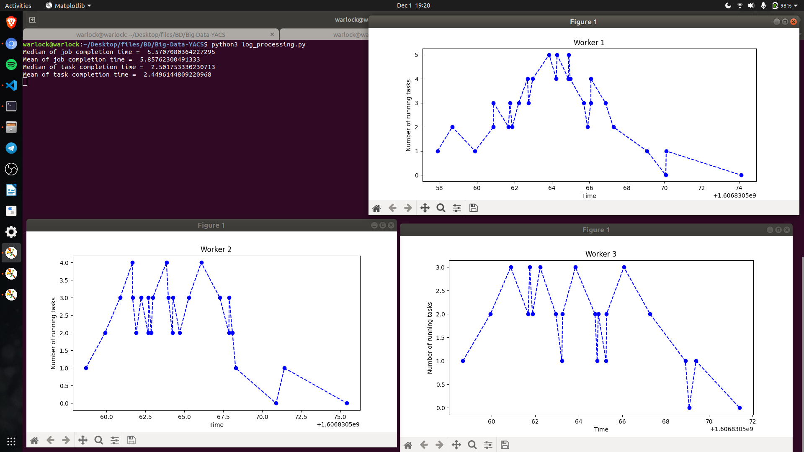

# Big-Data-YACS

## Modules used 

> logging <br>
> threading <br>
> socket <br>
> re<br>

## How to run 

Running the scheduler 
```
./run.sh
```
After sending all the requests from requests.py file, close all the terminals and then execute the following command in the same working directory<br>
```
python3 analysis.py
```


> <b> If any changes in scheduling algorithms or number of requests in command line argument are required, it can be done in run.sh </b>
<br>

## Screenshots

### Using RANDOM Scheduler 

<p>
    
</p>
<br>
<br>

### Using Least Loaded Scheduler 
<p>
    
</p>
<br>
<br>

### Using Round Robin Scheduler 
<p>
    
</p>
Thanks for the visit!
